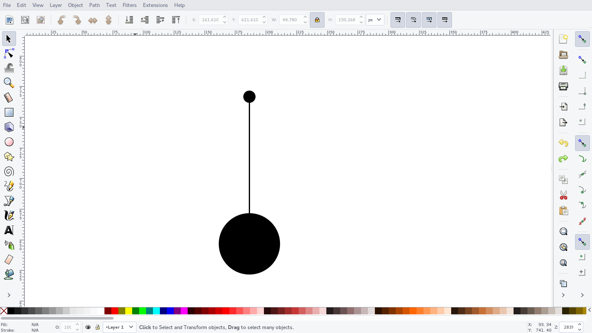
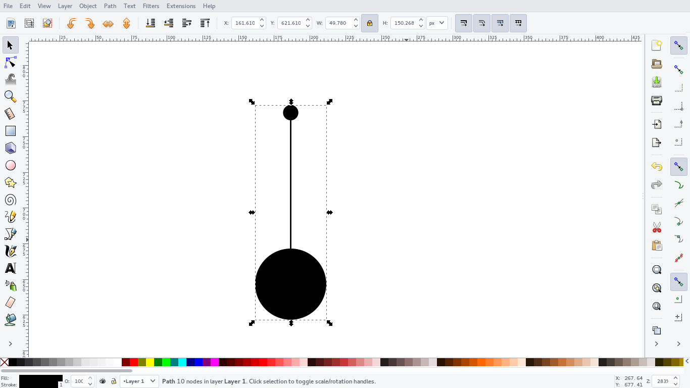
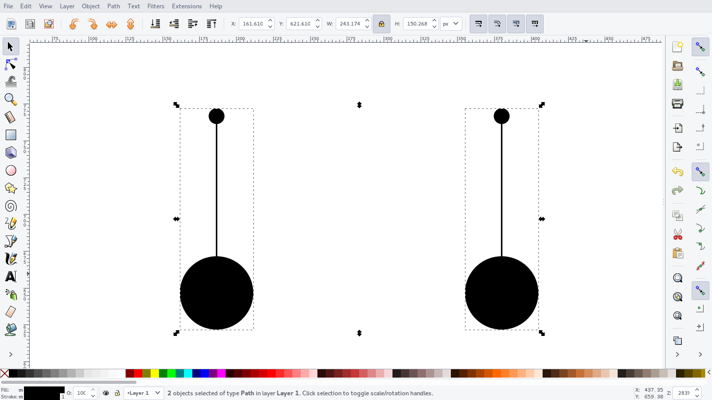
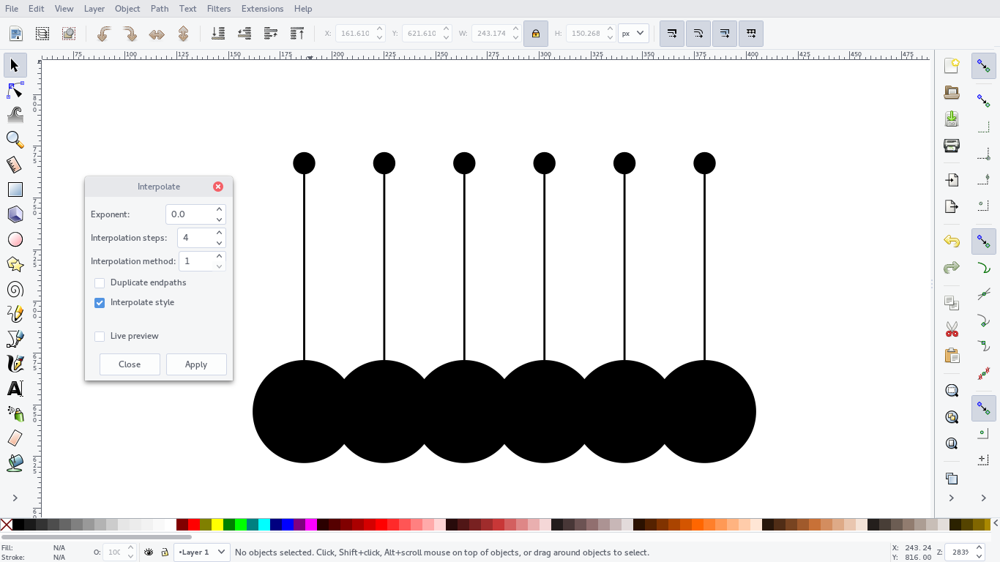
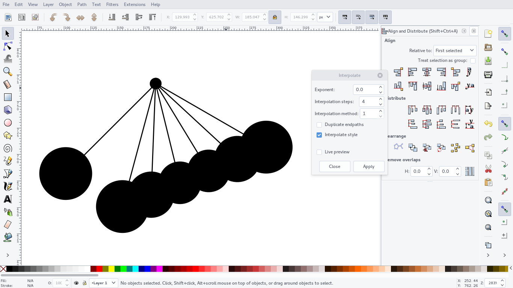

# SMIL4Inkscape
an inkscape extension for declarative animation using SMIL

## Resources

- [Script Extensions](http://wiki.inkscape.org/wiki/index.php/Script_extensions)
- [Tips For Python Script Extensions](http://wiki.inkscape.org/wiki/index.php/Tips_For_Python_Script_Extensions)
- [How to get started on writing extensions?](http://www.inkscapeforum.com/viewtopic.php?t=9223)
- [PythonEffect Tutorial](http://wiki.inkscape.org/wiki/index.php/PythonEffectTutorial)
- [Write an Inkscape extension: create multiple duplicates](http://www.hoboes.com/Mimsy/hacks/write-inkscape-extension-create-multiple-duplicates/)
- [lxml.etree in python](http://lxml.de/tutorial.html)
- [SVG animation](http://wiki.inkscape.org/wiki/index.php/SVG_Animation)
- Inkscape animation proposals [[1](http://wiki.inkscape.org/wiki/index.php/SVG_Animation_UI)], [[2](http://blogs.kiyut.com/tonny/2007/12/06/svg-animation-editor-feedback/#.WLEjBfF96is)], [[3](http://wiki.inkscape.org/wiki/index.php/SVG_Animation_MockupUI)], [[4](http://web.archive.org/web/20150120135418/http://www-user.uni-bremen.de/~felwert/inkscape/Animation01.html)]
- [SVG-SMIL animation tutorial](https://edutechwiki.unige.ch/en/SVG-SMIL_animation_tutorial)
- [Interactive SVG-SMIL animation tutorial](https://edutechwiki.unige.ch/en/Interactive_SVG-SMIL_animation_tutorial#Simple_click_and_mouse-over_examples)
- [Inkscape extensions by non developers, for non developers. A primer.](https://medium.com/@xaviju/inkscape-extensions-by-non-developers-for-non-developers-a-primer-b272dda360fe)

## Usual Interpolation in Inkscappe

Available path interpolation extension in inkscape would help in generating required intermediate frames.

1. create objects

2. Convert them into path

3. Combine the paths into single path (use path -> combine)

4. the current path is the start path

5. duplicate to create a destination path

6. Use : select extensions -> generate from path -> interpolate
